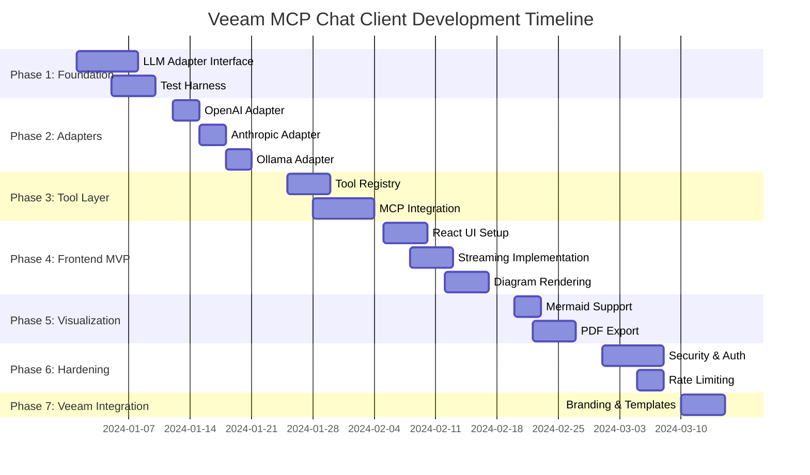

# Veeam MCP Chat Client

A thick desktop application that connects to existing MCP servers and multiple AI models, providing a unified chat interface, tool integration, and artifact rendering for Veeam workflows.

## 🎯 Overview

The Veeam MCP Chat Client is designed to be similar to Claude Desktop but customized for Veeam workflows. It supports:

- **Universal MCP Chat Client**: Connect to existing MCP servers via configuration
- **Multiple Model APIs**: OpenAI, Anthropic, Grok, Hugging Face, Ollama/Llama
- **Configurable Tool System**: YAML/JSON config for registered tools
- **Chat + Artifact UI**: Modern desktop app with markdown, diagrams, tables, and charts
- **Visualization & Reporting**: Auto-generate summaries, reports, and incident diagrams
- **Secure Backend**: FastAPI with SSE/WebSocket for real-time responses

## 🗺️ Development Roadmap



## 📁 Project Structure

```
veeam-mcp-chat-client/
├── backend/
│   ├── app/
│   │   ├── adapters/          # LLM provider adapters (OpenAI, Anthropic, Ollama)
│   │   ├── api/               # FastAPI routes
│   │   ├── core/              # Core interfaces and schemas
│   │   └── main.py            # FastAPI application
│   ├── tests/                 # Test suite
│   ├── examples/              # Usage examples
│   └── requirements.txt
├── frontend/
│   ├── src/
│   │   ├── components/        # React components (Sidebar, Chat, etc.)
│   │   ├── services/          # API clients
│   │   ├── types/             # TypeScript types
│   │   └── App.tsx            # Main application
│   └── package.json
├── config/                    # Configuration files
└── README.md
```

## 🚀 Getting Started

### Prerequisites

- Python 3.10+
- Node.js 18+
- pip and npm/yarn

### Installation

1. **Backend Setup**:
```bash
cd backend
python -m venv venv
source venv/bin/activate  # On Windows: venv\Scripts\activate
pip install -r requirements.txt
```

2. **Frontend Setup**:
```bash
cd frontend
npm install
```

### Running the Application

**Backend**:
```bash
cd backend
uvicorn app.main:app --reload --host 0.0.0.0 --port 8000
```

**Frontend** (development):
```bash
cd frontend
npm install  # First time only
npm run dev
```

The frontend will be available at `http://localhost:3000` and will proxy API requests to the backend.

## 🧪 Testing

Run the test harness to validate LLM adapter connections:

```bash
cd backend
pytest tests/ -v
```

Run specific adapter tests:
```bash
pytest tests/test_adapters/test_openai_adapter.py -v
pytest tests/test_adapters/test_anthropic_adapter.py -v
pytest tests/test_adapters/test_ollama_adapter.py -v
```

## 📝 Configuration

Create a `config/config.yaml` file with your API keys and MCP server configurations:

```yaml
llm_providers:
  openai:
    api_key: ${OPENAI_API_KEY}
    base_url: "https://api.openai.com/v1"
  anthropic:
    api_key: ${ANTHROPIC_API_KEY}
    base_url: "https://api.anthropic.com"
  ollama:
    base_url: "http://localhost:11434"

mcp_servers:
  veeam:
    command: "node"
    args: ["path/to/veeam-mcp-server"]
  wazuh:
    command: "python"
    args: ["path/to/wazuh-mcp"]
```

## 🔒 Security

- API keys are stored securely using environment variables
- Never commit secrets to version control
- Use `.env` files for local development (add to `.gitignore`)

## 🤝 Contributing

1. Follow the development roadmap phases
2. Write tests for new adapters and features
3. Ensure code passes linting and type checking
4. Update documentation for new features

## 📄 License

[Your License Here]

